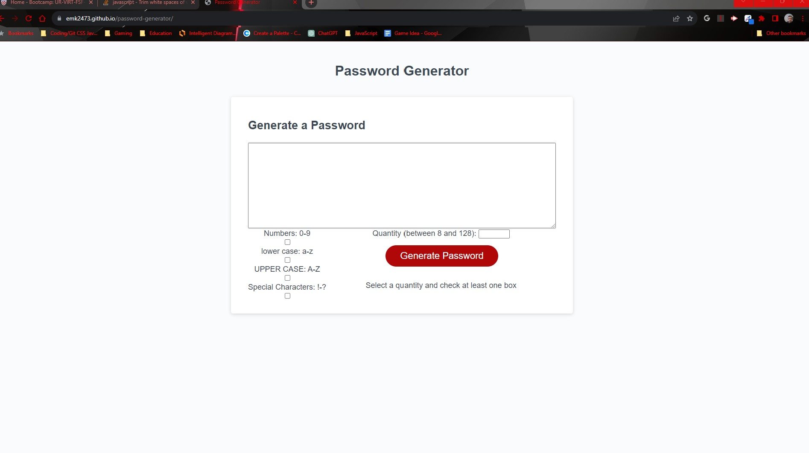

# Password Generator Challenge

In this challenge, I:

- Developed my own starter code.
- Added check boxes and an input text box to the HTML page.
- Defined my Global Variables to be strings of lowercase, uppercase, numbers, and special characters.
- Wrote 1 single function to handle the process.
- wrote methods for defining the local variables: quantity, special_source, lowercase_source, uppercase_source, and numbers_source.
- Set the password to be an open string.
- Created a local Array inside the function containing the global variables [lowercase, uppercase, numbers, special]
- wrote 4 "if" conditional statements, determining if the checkboxes I added were !(not)-true, then they would splice out the array position not chosen.
- I added an "if" conditional statement that gives an error alert if NO type is selected, or if a quantity selected is not <= 8, or =< 128.
- I wrote a "for loop" that lets the index = 1, and if it is <= the quantity, it will iterate 1 to i.
- I wrote "type_selection" as a method to use Math.floor and Math.random, giving me a random number between the array of type (0,1,2,3)
- I wrote "character selection" as a method to use Math.floor and Math.Random, giving me a random index(character) from the randomly selected string
- I then wrote the local "password" being generated in the function to equal the results of the previous two methods and display in a string
- I then used a querySelector to display the value of the password inside the (id)#textarea
- Then I used the starter code's variable for generateBtn, and the addEventListener to fire the code with the red button.

## This project was SO cool and I really enjoyed working it out.

Deployed Link: https://emk2473.github.io/password-generator/
Repo Link: https://github.com/EMK2473/password-generator

Screenshot of Deployed Site:

