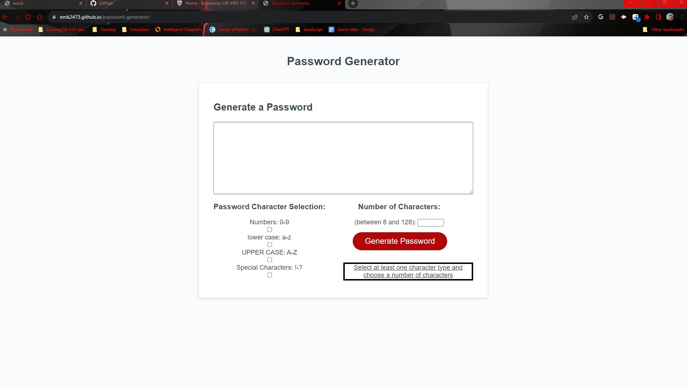

# Password Generator

## Description:

- This password generator functions to generate random passwords by first selecting a quantity, or a number of characters, for the password. Then, by selecting the type of characters you would like to include. Clicking "Generate Password" will then generate a password betweeo 8 and 128 characters, including the type of characters selected by the user. If a quantity of characters outside of the 8 to 128 is selected, or if no character type is selected, then an alert will appear for the user to see.

Deployed Link: https://emk2473.github.io/password-generator/

Repo Link: https://github.com/EMK2473/password-generator/

Screenshot of Deployed Site:

